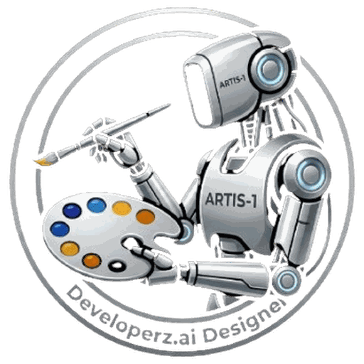

<p align="center">
  
</p>

# Developerz.ai Designer

> **Design in the live page. Ship the real code.**

Chrome extension. Open any page — your prod app or `localhost` — open a side-panel chat, and tell an agent what to change. It mutates the live DOM/CSS instantly so you *see* it. When you like it, click **Ship** and the agent hands the change off over **MCP** to a dev-agent backend ([Tesote ai-dev](https://ai-dev.miamibeachstart.com/mcp) / developerz.ai) that makes the real code change and opens a PR.

Not a page builder. Not a Figma clone. It edits **your codebase**, and the only durable output is a reviewable PR.

## The loop

```
You ─chat─► Agent ─DOM tools─► live page (ephemeral)
              │                    │ iterate, see it instantly
              │ "Ship"             ▼
              └─► changeset (selectors, styles, screenshots, intent)
                     │ MCP
                     ▼
              ai-dev / developerz.ai ─► real code edit ─► PR ─► CI
```

## Why

- Design tools produce mockups, not code — someone re-implements them by hand.
- DevTools edits the live page, but the edits vanish on reload and never reach the repo.
- Coding agents write from text prompts, blind to what the page actually looks like.

The gap: **what you see** (the rendered page) and **what you change** (the source) are disconnected. Designer closes it — design on the real page, ship a real PR, one conversation.

## How it works

| Step | Where | What happens |
|------|-------|--------------|
| Talk | Side-panel chat | "Make the hero full-bleed, CTA orange, tighten the nav." |
| See | Live page | Agent mutates real DOM/CSS. Instant. You react, refine. |
| Accept | Side-panel chat | Each change recorded as a structured changeset entry (edit chips + undo). |
| Ship | MCP handoff | Changeset → dev-agent → finds source → edits code → PR. |
| Verify | PR / CI | Real change, tested, reviewable. You merge. |

- **Live edits are ephemeral.** Mutations never persist to the site. Reload = clean page.
- **BYOK.** OpenRouter key for the design agent. MCP token for the dev backend. We never resell tokens.
- **Human in the loop.** "Ship" is a button, not an inference. The agent never auto-merges.

## Quickstart

```bash
bun install
bun run dev                 # WXT dev server, HMR
```

1. **Load unpacked** — `chrome://extensions` → Developer mode → Load unpacked → `.output/chrome-mv3`.
2. **Add your OpenRouter key** — side panel → settings (BYOK, stored encrypted, used only in the service worker).
3. **Connect a backend** — MCP tab → add `https://ai-dev.miamibeachstart.com/mcp` (or developerz.ai). OAuth on first use.
4. **Open any page**, open the side panel, start designing.

Release build (tree-shaken, minified, optimized CSS/JS):

```bash
bun run release            # wxt build && wxt zip → .output/*.zip
```

## Stack

| Component | Technology |
|-----------|-----------|
| Extension | Chrome MV3 — side panel, content scripts, service worker |
| UI | [SolidJS](https://www.solidjs.com/) + SCSS — prebuilt static bundle (CSP-clean) |
| Agent | [Vercel AI SDK](https://github.com/vercel/ai) loop in the service worker, BYOK |
| Inference | [OpenRouter](https://openrouter.ai/docs) — model-agnostic |
| Handoff | [MCP](https://modelcontextprotocol.io/) → [ai-dev](https://ai-dev.miamibeachstart.com/mcp) / developerz.ai |
| Build | [Bun](https://bun.sh/) + TypeScript + [WXT](https://wxt.dev/) |
| Tests | [Vitest](https://vitest.dev/) unit + integration, [Playwright](https://playwright.dev/) E2E |
| Lint | [Biome](https://biomejs.dev/) |

## Docs

| | |
|--|--|
| [docs/idea/](docs/idea/README.md) | Vision, the design→ship loop, principles, surfaces |
| [docs/architecture/](docs/architecture/README.md) | Components, MV3 worlds, agent loop, handoff, security, ADRs |
| [Privacy policy](docs/architecture/privacy.md) | Data handling: BYOK inference, ephemeral edits, changeset-only durable output |

## Status

Spec + scaffold phase. v0: live-edit + chat, no handoff. v1: full MCP handoff to ai-dev.
