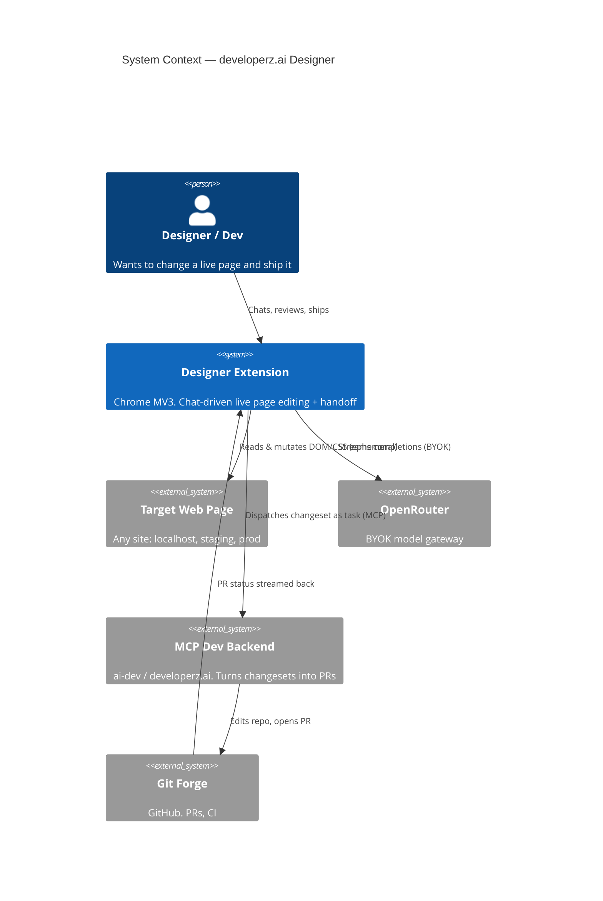

# Architecture

Deep reference for developerz.ai Designer. For the elevator pitch see [`../idea/README.md`](../idea/README.md); this set goes down to worlds, sequences, and trade-offs.

**System:** a Chrome MV3 extension. Chat with an agent → it live-edits the page → ship the result as real code via MCP handoff to a dev-agent backend (ai-dev / developerz.ai).

## Read in this order

| File | Scope |
|------|-------|
| [components.md](components.md) | Container/component view, responsibility table |
| [mv3-worlds.md](mv3-worlds.md) | Three execution worlds, message bus, SW ephemerality |
| [agent-loop.md](agent-loop.md) | Vercel AI SDK loop, tool cycle, vision self-correction |
| [changeset.md](changeset.md) | Data model, selector strategy, frameworkHints bridge |
| [handoff.md](handoff.md) | Ship → MCP task → PR, status stream-back |
| [security.md](security.md) | Threat model, key custody, least privilege |
| [privacy.md](privacy.md) | Data categories, key custody, what reaches the model + MCP, permissions |
| [adr/](adr/) | Decision records |

## System context (C4 L1)

## Core invariants

| Invariant | Where enforced |
|-----------|----------------|
| Page edits are ephemeral; only output is a changeset + PR | [changeset.md](changeset.md) |
| Secrets live only in the service worker | [security.md](security.md), [mv3-worlds.md](mv3-worlds.md) |
| Agent never auto-ships; Ship is a user action | [handoff.md](handoff.md) |
| No remote code (CSP/MV3); Solid is prebuilt | [security.md](security.md) |
| Source of truth is the repo, not the page | [handoff.md](handoff.md) |
