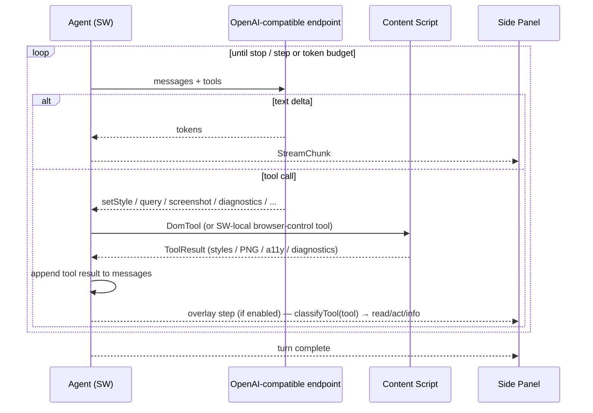
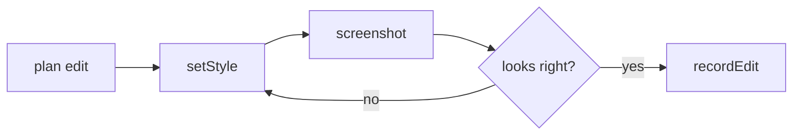

# Agent loop

[Vercel AI SDK](https://github.com/vercel/ai) `ToolLoopAgent` in the service worker, talking to any OpenAI-compatible `/v1` endpoint (`createOpenAICompatible`, OpenRouter is a preset) via `src/agent/provider.ts`, driving DOM tools in the content script. See [`../idea/agent.md`](../idea/agent.md) for the tool catalog and modes.

## Shape

```ts
// src/agent/loop.ts
const agent = new ToolLoopAgent({
  model: createProvider(cfg),        // BYOK, any openai-compatible endpoint
  instructions: buildSystemPrompt(mode),  // v7 name — NOT `system`
  tools: buildTools(deps),            // merged per-module tool sets, see below
  stopWhen: [isStepCount(budget.maxSteps), tokenBudgetGuard(budget.maxTokens)],
});
agent.stream({ messages, abortSignal, onStepFinish });
```

- The model has **no DOM handle** — it lives in the SW. Tools are the only effect path.
- Tool calls are routed over the bus to the content script and awaited (see [mv3-worlds.md](mv3-worlds.md)).
- Text-delta / tool-call / abort / error stream parts are iterated and forwarded to the panel as `StreamChunk`s.

## Tool set assembly (`buildTools`, `src/agent/loop.ts`)

Merges one AI SDK tool set per module under `src/agent/tools/` (`dom`, `interact`, `tabs`, `vision`, `describe`, `identity`, `responsive`, `complex-site`, `browse`, `session`), conditionally on the deps actually injected, then attaches vision hooks (`screenshotToModelOutput`, `responsiveCaptureToModelOutput`) and merges any extra caller-supplied tools last (winning on name clash). See [`../idea/agent.md`](../idea/agent.md#tool-catalog) for the per-module purpose.

## Modes (`src/agent/modes.ts`)

`resolveMode(explicit, text)` — an explicit composer selection wins, else keyword inference (debug checked first). A mode only appends an addendum to `buildSystemPrompt`'s output (`src/agent/system-prompt.ts`) and supplies an advisory tool-emphasis order — it never filters the tool set. Two modes: `copy` (browse reference → extractIdentity → apply), `debug` (diagnostics → observe → hypothesize → reproduce → capture → confirm → root-cause → fix). See [`../idea/agent.md`](../idea/agent.md#modes--copy-debug-srcagentmodests).

## Tool cycle



## Vision self-correction

- After a visual mutation the agent can call `screenshot` or `inspectVisually`, feed the crop back to a vision-capable model, and judge its own result — "too dark, nudge lighter" — without the user prompting.
- Cost control: cheap text model for planning/chat; vision only invoked when a screenshot is in the loop, capped by `maxVisionCalls`.



## Budgets & guardrails (`src/agent/budget.ts`)

| Guard | Mechanism |
|-------|-----------|
| Runaway loop | `TurnBudget.maxSteps` (24) via `stopWhen` |
| Token spend | `TurnBudget.maxTokens` (200k); stop + summarize |
| Vision cost | `maxVisionCalls` (6) |
| Waits / navigation | `maxWaitCalls` (10), `maxNavCalls` (8) — fails just that tool call |
| Destructive surprise | mutations reversible + previewed; user accepts before ship |
| Auto-ship | none — `handoff` is user-triggered only (see [handoff.md](handoff.md)) |
| Fragile selector | flagged in result; surfaced before record |

## Overlay forwarding

Every `tool-call` stream part is classified by `classifyTool` (`src/shared/overlay-step.ts`) into `read`/`act`/`info` with an extracted target selector, and — when the on-page overlay is enabled — mirrored into the content script's live decision overlay (`src/dom/overlay.ts`) via the SW's `forwardOverlayStep` (`src/entrypoints/background.ts`). This is a genuine live "watch the agent work" mirror of the tool stream, not a replay. See [`../idea/ui.md`](../idea/ui.md#overlay).

## Session persistence

`SessionStore` (`src/agent/session.ts`) keeps a per-tab `TurnSession` (changeset + model-message thread + usage) mirrored to `chrome.storage.session` so an evicted service worker rehydrates before handling the next message (see [mv3-worlds.md](mv3-worlds.md#service-worker-ephemerality)).

## Optional: design-time MCP reads

If the connected MCP backend exposes read tools (e.g. ai-dev KB / repo search), the agent may consult them **while designing** ("what design tokens exist?") so edits already speak the codebase's language — shrinking handoff guesswork. MCP is never required for the loop to run (see [`../idea/mcp.md`](../idea/mcp.md)).
