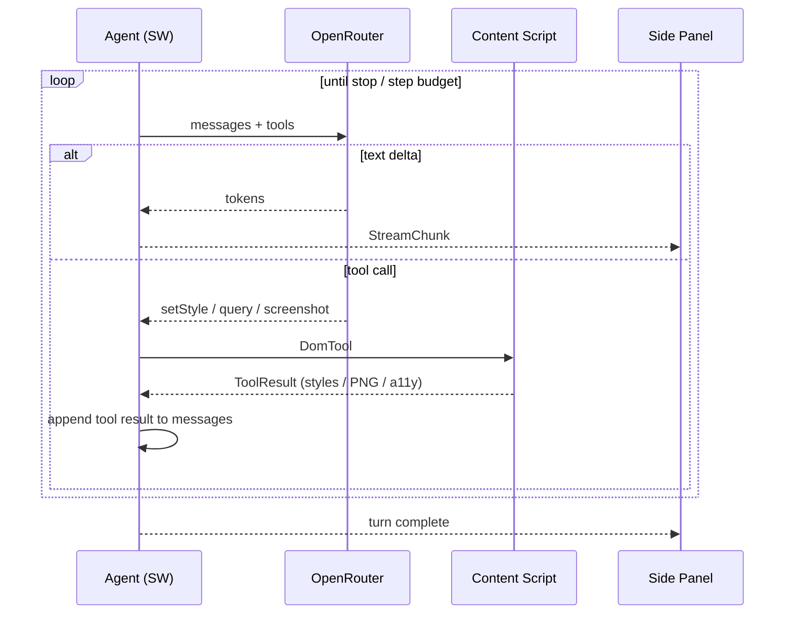
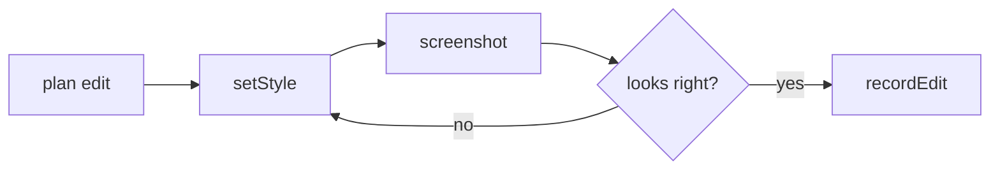

# Agent loop

[Vercel AI SDK](https://github.com/vercel/ai) `streamText` loop in the service worker, talking to [OpenRouter](https://openrouter.ai/docs) (BYOK), driving DOM tools in the content script. See [`../idea/agent.md`](../idea/agent.md) for the tool catalog.

## Shape

```ts
streamText({
  model: openrouter(session.model),   // BYOK, model-agnostic
  instructions: designerSystemPrompt,
  messages: history,
  tools,                              // page-read / page-mutate / session
  stopWhen: isStepCount(MAX_STEPS),   // budget guard
})
```

- The model has **no DOM handle** — it lives in the SW. Tools are the only effect path.
- Tool calls are routed over the bus to the content script and awaited (see [mv3-worlds.md](mv3-worlds.md)).
- Tokens stream to the side panel as they arrive.

## Tool cycle



## Vision self-correction

- After a visual mutation the agent can call `screenshot`, feed the crop back to a vision-capable model, and judge its own result — "too dark, nudge lighter" — without the user prompting.
- Cost control: cheap text model for planning/chat; vision model invoked **only** when a screenshot is in the loop.



## Budgets & guardrails

| Guard | Mechanism |
|-------|-----------|
| Runaway loop | `stopWhen: isStepCount(N)` |
| Token spend | per-turn token cap; stop + ask the user |
| Destructive surprise | mutations reversible + previewed; user accepts before record |
| Auto-ship | none — `handoff` is user-triggered only (see [handoff.md](handoff.md)) |
| Fragile selector | flagged in result; surfaced before record |

## Optional: design-time MCP reads

If the connected MCP backend exposes read tools (e.g. ai-dev KB / repo search), the agent may consult them **while designing** ("what design tokens exist?") so edits already speak the codebase's language — shrinking handoff guesswork.
