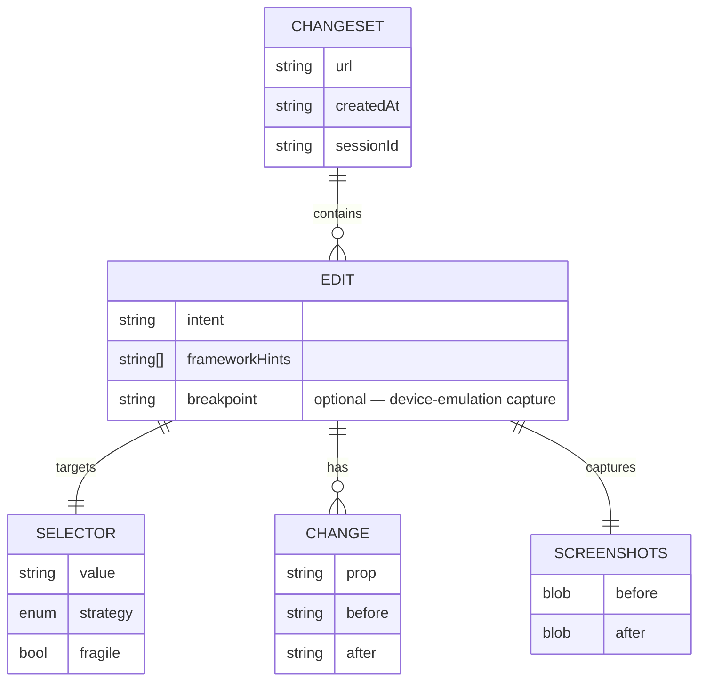

# Changeset

The portable diff of a design session. Page mutations are ephemeral — the changeset (plus, for debug sessions, an agent-authored `Report`) is the durable record, consumed by [handoff](handoff.md) either as an MCP task or a downloadable Markdown brief (`src/changeset/report-md.ts`). Built by the recorder; schema in `src/shared/changeset.ts`. See [`../idea/live-edit.md`](../idea/live-edit.md) for the recorder UX.

## Model



```jsonc
{
  "url": "http://localhost:3000/pricing",
  "createdAt": "2026-06-21T12:00:00Z",
  "sessionId": "a3e1c9f2-6b7d-4e8a-9c01-5f2d3b4a6e70",
  "edits": [{
    "intent": "Make the primary CTA orange and larger",
    "selector": { "value": "[data-testid=cta-primary]", "strategy": "data-attr", "fragile": false },
    "changes": [
      { "prop": "background-color", "before": "#2563eb", "after": "#f97316" },
      { "prop": "padding", "before": "8px 16px", "after": "12px 24px" }
    ],
    "screenshots": { "before": "blob:…", "after": "blob:…" },
    "frameworkHints": ["react", "tailwind: bg-blue-600 px-4 py-2"]
  }]
}
```

Schema is Zod in `src/shared/changeset.ts` and shared verbatim with the recorder, store, and serializer. `ChangesetState` wraps the append-only edit log with a `redoStack` (`src/shared/changeset.ts`) so undo/redo is a pure pop/push, not a re-derivation.

## Selector resolution

Ordered strategies — first that uniquely matches wins. The chosen strategy and a fragility flag travel with the edit so the dev-agent can re-find the element in **source** even when the runtime DOM differs.

| # | Strategy | `strategy` | Fragile? |
|---|----------|-----------|----------|
| 1 | `data-testid` / stable `data-*` | `data-attr` | no |
| 2 | non-generated `id` | `id` | no |
| 3 | ARIA role + accessible name | `aria` | no |
| 4 | unique text content | `text` | low |
| 5 | scoped CSS path | `css-path` | **yes** (flagged) |
| 6 | shadow-DOM host path (`>>>`) | `shadow` | **yes** (flagged) — needed for web-component/complex-site targets (`src/dom/selector.ts`) |

## frameworkHints — the source-mapping bridge

Runtime CSS values don't tell the dev-agent *where in source* to edit. `frameworkHints` does:

| Hint | Tells dev-agent |
|------|-----------------|
| `tailwind: bg-blue-600 px-4 py-2` | swap utility classes, not raw CSS |
| `css-module: Button_primary__x1` | edit the `.primary` rule in the module |
| `styled-components` / marker | find the styled block |
| `react` / `vue` / `solid` | component framework in play |
| design-token guess (`--color-accent`) | prefer the token over a literal |

Without hints handoff still works (raw before/after CSS), but with them the resulting PR matches the repo's own conventions. See [handoff.md](handoff.md).

## Markdown report — the fallback serialization

`toMarkdown(report)` (`src/changeset/report-md.ts`) renders identity tokens plus per-breakpoint responsive findings/screenshots into a paste-ready Markdown brief. It is not just a fallback artifact — the **same** rendering is attached as the `brief` field on every MCP `task(action:'create')` spec (`src/mcp/handoff.ts`), and it's the whole payload when [`routeHandoff()`](handoff.md) has no backend/repo to dispatch to (`src/mcp/backend.ts`). Triggered from `ShipBar.tsx`'s Download action via the `download-report`/`send-report` SW RPCs.

## Lifecycle

- Append-only event log → undo = pop onto `redoStack`; redo = pop back. No re-derivation.
- Lives in `chrome.storage.session`; cleared on tab close or "Clear session".
- Reload of the page wipes the live edits but **not** the recorded changeset (until session ends).
- On Ship/Download, the finished session (changeset + report + PR link if shipped) is retained in [history](../idea/ui.md#side-panel-tabs) — up to the last 10 conversations, `chrome.storage.local`.
