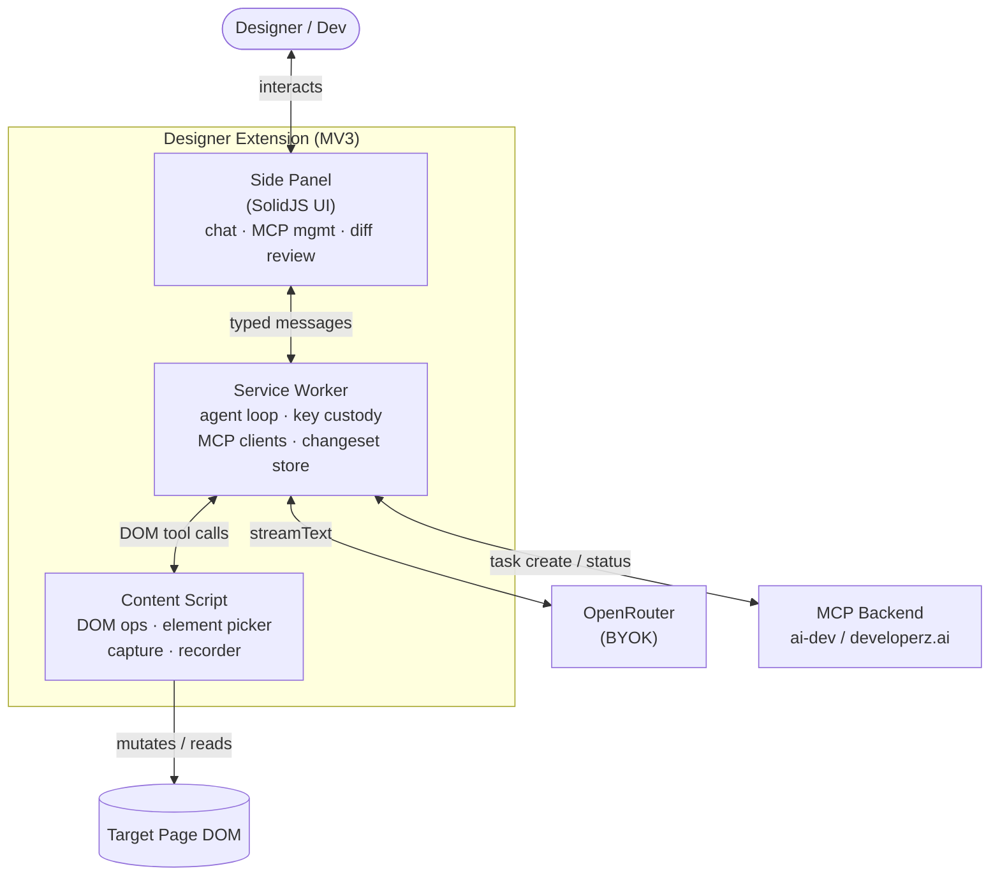

# Components

Container + component view. Three runtime worlds inside the extension (see [mv3-worlds.md](mv3-worlds.md)) plus three external systems.

## Container view (C4 L2)

## Responsibilities

| Component | Owns | Must NOT |
|-----------|------|----------|
| **Side Panel** (Solid) | Render chat, MCP management, diff/changeset review, screenshots. Local UI state. | Hold secrets. Call OpenRouter/MCP directly. Touch the page DOM. |
| **Service Worker** | Agent loop (Vercel AI SDK), OpenRouter client + key, MCP clients + tokens, changeset store, message routing. | Assume it stays alive — must rehydrate from `chrome.storage.session`. Render UI. |
| **Content Script** | DOM read/mutate primitives, element picker + overlay, screenshots/computed styles, changeset recorder events. | Hold secrets. Make network calls to model/MCP. Persist anything durable. |
| **OpenRouter** (ext) | Model-agnostic inference, vision. | — |
| **MCP Backend** (ext) | Map changeset → code change → PR; stream task status. | — |
| **Git Forge** (ext) | Host PR, run CI. | — |

## Internal modules (by directory)

| Path | Component | Role |
|------|-----------|------|
| `src/entrypoints/sidepanel/` | Side Panel | Solid app shell, routes, stores |
| `src/entrypoints/background.ts` | Service Worker | Loop bootstrap, message bus host |
| `src/entrypoints/content.ts` | Content Script | DOM bridge bootstrap |
| `src/agent/` | SW | Loop, tool defs, prompts |
| `src/dom/` | Content | Mutation primitives, selector engine |
| `src/changeset/` | SW + Content | Recorder (content), store + serializer (SW) |
| `src/mcp/` | SW | MCP client manager, auth |
| `src/shared/` | all | Zod schemas, message types |

Module boundaries map 1:1 to world boundaries — a module never reaches across a world except through the typed bus.
