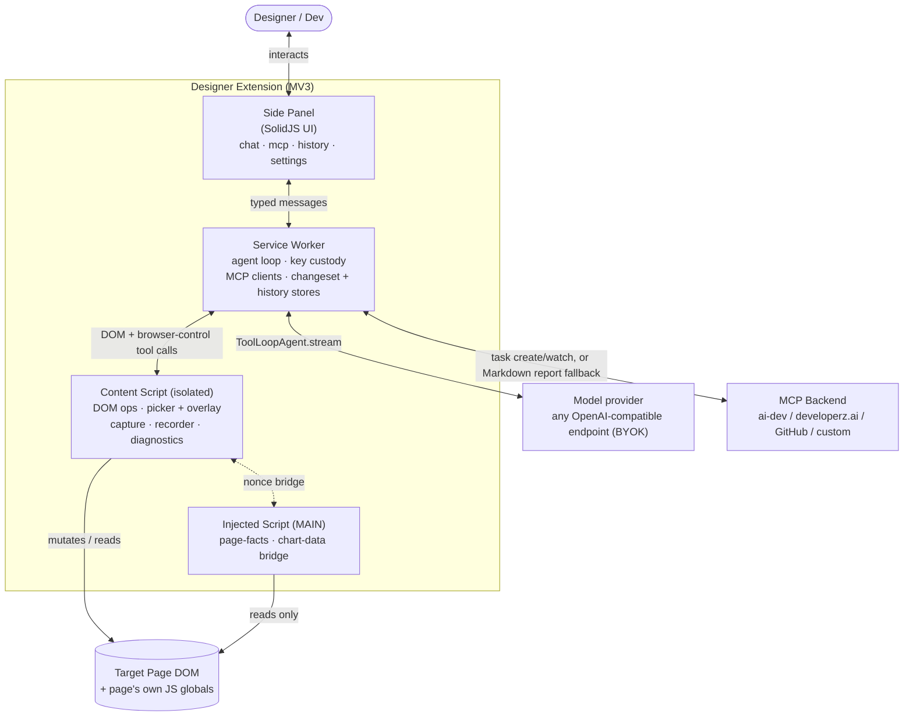

# Components

Container + component view. Four runtime worlds inside the extension (see [mv3-worlds.md](mv3-worlds.md)) plus three external systems.

## Container view (C4 L2)

## Responsibilities

| Component | Owns | Must NOT |
|-----------|------|----------|
| **Side Panel** (Solid) | Render chat, MCP management, history, settings, readiness header, changeset/ship UI. Local UI state. | Hold secrets. Call the model provider/MCP directly. Touch the page DOM. |
| **Service Worker** | Agent loop (`ToolLoopAgent`), provider client + key custody, MCP clients + tokens, changeset store, history store, readiness computation, message routing. | Assume it stays alive — must rehydrate from `chrome.storage.session`. Render UI. |
| **Content Script (isolated)** | DOM read/mutate primitives, element picker + agent-decision overlay, diagnostics collection, screenshots/computed styles, changeset recorder events, bridge client to MAIN. | Hold secrets. Make network calls to the provider/MCP. Persist anything durable. |
| **Injected Script (MAIN)** | Read-only access to the page's own JS globals — chart-lib instances, framework/runtime detection. | Hold secrets, receive them, or make network calls. Mutate anything. |
| **Model provider** (ext) | Model-agnostic inference, vision. Any OpenAI-compatible `/v1` endpoint; OpenRouter is a preset. | — |
| **MCP Backend** (ext) | Map changeset/report → code change → PR; stream task status. Optional — absence triggers the Markdown report fallback. | — |
| **Git Forge** (ext) | Host PR, run CI. | — |

## Internal modules (by directory)

| Path | Component | Role |
|------|-----------|------|
| `src/entrypoints/sidepanel/` | Side Panel | Solid app shell, tabs (chat/mcp/history/settings), stores |
| `src/entrypoints/background.ts` | Service Worker | Loop bootstrap, message bus host, overlay-step forwarding |
| `src/entrypoints/content.ts` | Content Script | DOM bridge bootstrap (isolated world) |
| `src/entrypoints/injected.content.ts` | Injected Script | MAIN-world bridge server (`page-facts`, `chart-data`) |
| `src/agent/` | SW | Loop, provider, readiness, modes, budget, session, system prompt, history store, browse-tab, browser-control, tool defs (`src/agent/tools/`) |
| `src/dom/` | Content | Mutation/read primitives, selector engine, picker, overlay, recorder, diagnostics collector, page-facts, describe/identity, charts/widgets, responsive |
| `src/changeset/` | SW | Changeset store (undo/redo), Markdown report renderer |
| `src/mcp/` | SW | MCP client + manager, auth (admin/worker key, OAuth+PKCE, user token), server store, handoff routing |
| `src/shared/` | all | Zod message schemas, changeset/report schema, overlay-step classifier, port/relay plumbing |

Module boundaries map 1:1 to world boundaries — a module never reaches across a world except through the typed bus (or the nonce-guarded MAIN bridge).
