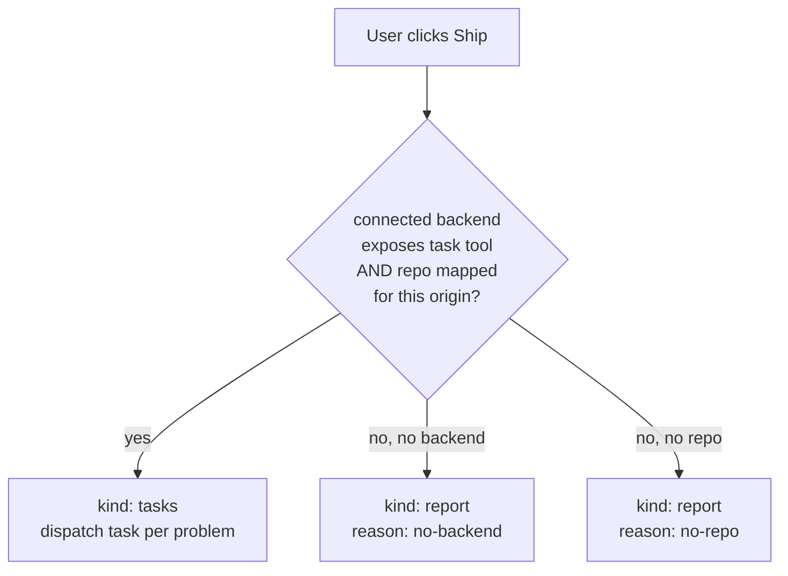
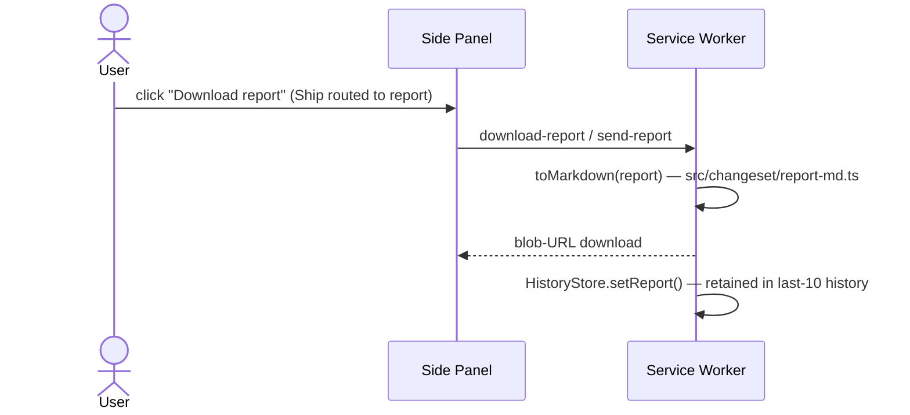

# Handoff

Turning a changeset (+ debug report) into real code — **two routed paths**. The boundary between *design* (this extension) and *implementation* (an MCP dev backend, or whatever coding agent the user pastes the report into). See [`../idea/handoff.md`](../idea/handoff.md) and [`../idea/mcp.md`](../idea/mcp.md).

**Ship/Download is a user action.** The agent never dispatches on its own.

## Routing (`src/mcp/backend.ts::routeHandoff`)



`taskBackends()` filters connected MCP servers for one exposing `<id>__task`; `resolveRepo()` looks up the page's origin in the persisted `OriginRepoMap` (`src/mcp/store.ts`). Both must hold for the `tasks` path. `fallbackMessage()` names the missing piece so the panel can tell the user what to connect next.

## Sequence — tasks path (MCP)

```mermaid
sequenceDiagram
    actor U as User
    participant SP as Side Panel
    participant SW as Service Worker
    participant MCP as MCP Backend (ai-dev)
    participant DEV as Dev-Agent (VM)
    participant GH as GitHub

    U->>SP: review changeset, click "Ship"
    SP->>SW: ShipRequest
    SW->>SW: routeHandoff() → tasks; planTasks() builds TaskSpec[] (brief = toMarkdown(report))
    SW->>MCP: task(action:"create", spec) — per problem
    MCP-->>SW: { taskId }
    MCP->>DEV: assign task
    DEV->>DEV: locate source via selectors + frameworkHints
    DEV->>DEV: edit code, run tests locally
    DEV->>GH: open PR
    GH-->>DEV: CI runs
    loop task(action:"watch")
        MCP-->>SW: status + PR url (task-status stream)
        SW-->>SP: TaskStatus
    end
    SP-->>U: PR link + status
```

## Sequence — report path (fallback)



## Task spec (what crosses MCP)

The changeset ([changeset.md](changeset.md)) plus framing, mapped onto the backend's `task` tool (ai-dev: `task(action:"create", …)`). Built by `planTasks()` (`src/mcp/handoff.ts`) — one spec per problem for a multi-finding debug `Report`, one spec for a bare design changeset.

| Field | From | Purpose |
|-------|------|---------|
| `title` / `summary` | agent | human-readable intent |
| `url` | changeset | which page/route |
| `edits[]` / findings | changeset / report | selectors, before/after, hints, screenshots |
| `repo` / `template` | MCP connection config (`frontend_dev` template for UI work) | where + which agent template |
| `brief` | `toMarkdown(report)` | same Markdown the report-fallback path would have produced — the dev-agent gets it too |
| `source` | constant `developerz-designer` | stamped on every spec |

## Status stream-back

- SW subscribes to `task(action:"watch")` and pushes `TaskStatus`/`task-status` to the panel.
- Side panel shows a timeline: `queued → working → pr_opened → ci_green / ci_red → merged / failed`.
- On `pr_opened`, surface the PR link. The user reviews and merges — **no auto-merge** (see [principles.md](../idea/principles.md)).

## Report fallback in detail

`toMarkdown()` (`src/changeset/report-md.ts`) is a complete renderer, not a stub — identity tokens, per-edit intent/selector/before-after, debug findings with severity/root-cause, and per-breakpoint responsive screenshots all render to one pasteable brief. `ShipBar.tsx`'s Download action triggers `download-report`; both `download-report` and `send-report` SW RPCs (`src/entrypoints/background.ts`) call the same renderer. The rendered report is retained in [history](../idea/ui.md#side-panel-tabs) so it isn't lost if the panel closes before the user pastes it elsewhere.

## Backend-agnostic

Any MCP server exposing a task-create capability works. Reference target is ai-dev (`task` domain tool); developerz.ai is the other first-class backend. The extension only needs: a task-create tool + a status/get-or-watch tool, namespaced `<server_id>__task` (see [`../idea/mcp.md`](../idea/mcp.md#namespacing)). No backend at all is a fully supported state — see [security.md](security.md) for token custody.
