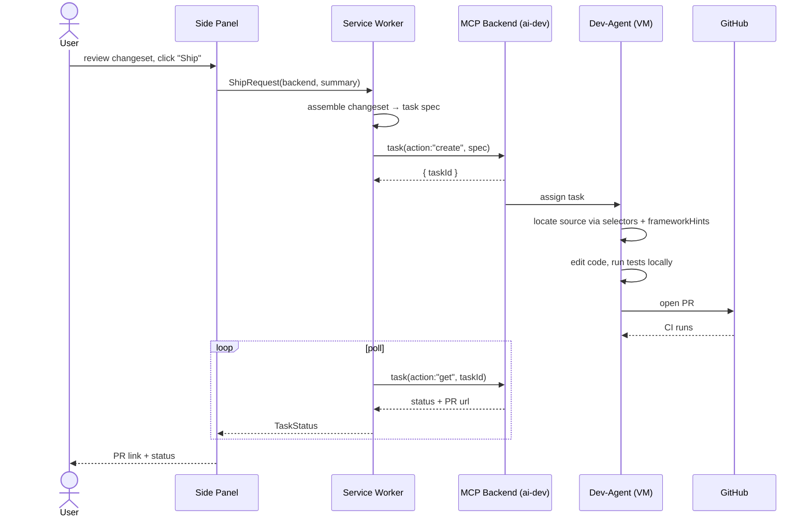

# Handoff

Turning a changeset into a real PR. The boundary between *design* (this extension) and *implementation* (the MCP dev backend). See [`../idea/handoff.md`](../idea/handoff.md) and [`../idea/mcp.md`](../idea/mcp.md).

**Ship is a user action.** The agent never dispatches on its own.

## Sequence

## Task spec (what crosses MCP)

The changeset ([changeset.md](changeset.md)) plus framing, mapped onto the backend's `task` tool (ai-dev: `task(action:"create", …)`).

| Field | From | Purpose |
|-------|------|---------|
| `title` / `summary` | agent | human-readable intent |
| `url` | changeset | which page/route |
| `edits[]` | changeset | selectors, before/after, hints, screenshots |
| `repo` / `template` | MCP connection config | where + which agent template |
| `intent` per edit | recorder | the "why", drives idiomatic code |

## Status stream-back

- v1: SW **polls** `task(action:"get")` and pushes `TaskStatus` to the panel.
- v2: subscribe to backend events (ai-dev exposes task `watch`) for push updates.
- Terminal states: `pr_opened`, `ci_green`, `merged`, `failed` → surfaced with PR link.

## Backend-agnostic

Any MCP server exposing a task-create capability works. Reference target is ai-dev (`task` domain tool); developerz.ai is the other first-class backend. The extension only needs: a task-create tool + a status/get tool. See [security.md](security.md) for token custody.
