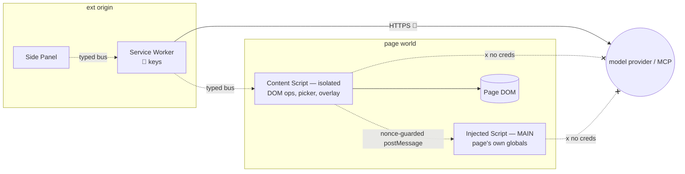
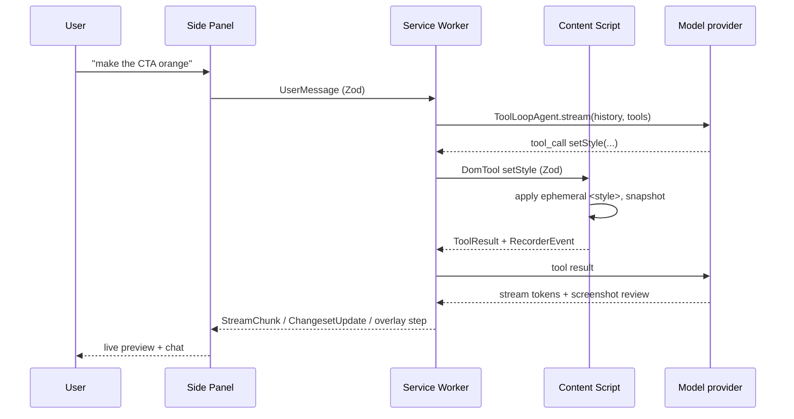

# MV3 worlds

Four execution worlds, hard boundaries. Crossing one always goes through the typed message bus (isolated ↔ SW ↔ panel) or a nonce-guarded `postMessage` bridge (isolated ↔ MAIN).

| World | Origin / context | Trust | Can reach |
|-------|------------------|-------|-----------|
| **Side Panel** | Extension origin, isolated document | UI-trusted, no secrets | bus → SW |
| **Service Worker** | Extension origin, no DOM, ephemeral | secret-holder | model provider, MCP, `chrome.storage`, bus |
| **Content Script** (isolated) | Injected, shares the page's tab world, own JS globals | page-adjacent, untrusted-ish | DOM, bus → SW, bridge → MAIN |
| **Injected script** (MAIN) | `src/entrypoints/injected.content.ts`, runs in the page's *own* JS realm, every frame | untrusted — same as the page itself | page's own globals (framework internals, chart-lib instances) — nothing else |

## Why keys never touch the content script — or the MAIN world

- The content script runs in the **page's** world — the page's own scripts can observe its globals and any leaked references. The MAIN-world script *is* the page's own realm — strictly more exposed.
- A compromised/hostile page must never see the provider API key or MCP tokens.
- Therefore: all network calls to the model provider + MCP originate in the **service worker only**. The content script gets *commands*, returns *results* — never credentials. The MAIN world answers a narrow **read-only** RPC (`page-facts`, `chart-data`) and never receives or returns anything secret.

## MAIN-world bridge (`src/dom/bridge.ts`, `src/entrypoints/injected.content.ts`)

- Declared `world: 'MAIN'`, injected into every frame (`allFrames: true, matchAboutBlank: true`) — WXT emits the manifest `"world":"MAIN"` entry from that option, no manual `wxt.config.ts` registration.
- It's the only world that can read the page's own JS globals — needed to read real chart-lib instances (Chart.js/ECharts/Highcharts/D3/Recharts, see `src/dom/charts.ts`) and detect the framework/runtime stack (`src/dom/page-facts.ts`) beyond what DOM inspection alone reveals.
- `serveBridge()` answers requests from the isolated content script over `window.postMessage`, guarded by origin check, `source === window`, and a per-request nonce — read-only, request/response, no ambient access.

## Typed message bus

Every cross-world payload is a Zod discriminated union in `src/shared/messages.ts` (~1500 lines, grown well past chat+diff — DOM tools, browser-control, vision, complex-site/chart/widget, responsive, MCP, history, readiness, overlay). No raw `postMessage` shapes. No `any` crosses the bus.

| Channel | Direction | Examples |
|---------|-----------|----------|
| UI | panel ↔ SW | `PanelToSw` (chat, ship/download, provider config, picker), readiness, history, overlay opt-in, `StreamChunk` |
| DOM | SW ↔ content | `DomTool` (query/mutate/capture), browser-control (interact/tabs/frames/vision), `ToolResult`, `RecorderEvent` |
| Bridge | content ↔ MAIN | `page-facts`, `chart-data` — read-only, nonce-guarded `postMessage` (not Zod-bus, see [above](#main-world-bridge-srcdombridgets-srcentrypointsinjectedcontentts)) |

## Service-worker ephemerality

- MV3 can kill the SW at any idle moment. Treat it as **stateless between events**.
- In-flight turn state, changeset, and pending MCP tasks persist to `chrome.storage.session`.
- On wake, the SW **rehydrates** before handling the next message; the side panel is the source of truth for chat scrollback.

| State | Store | Lifetime |
|-------|-------|----------|
| Current turn / changeset | `chrome.storage.session` | Tab/session |
| Provider config, keys (encrypted), MCP connections, history (last 10), overlay pref | `chrome.storage.local` | Persistent |
| Chat scrollback | Side panel memory (+ session mirror) | Session |
