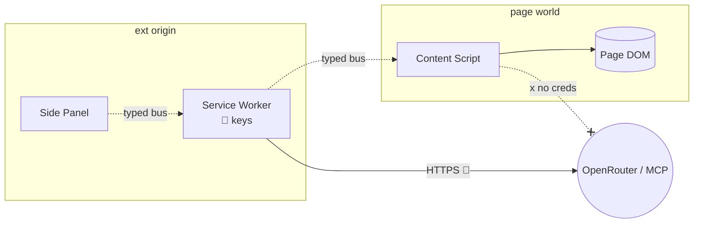
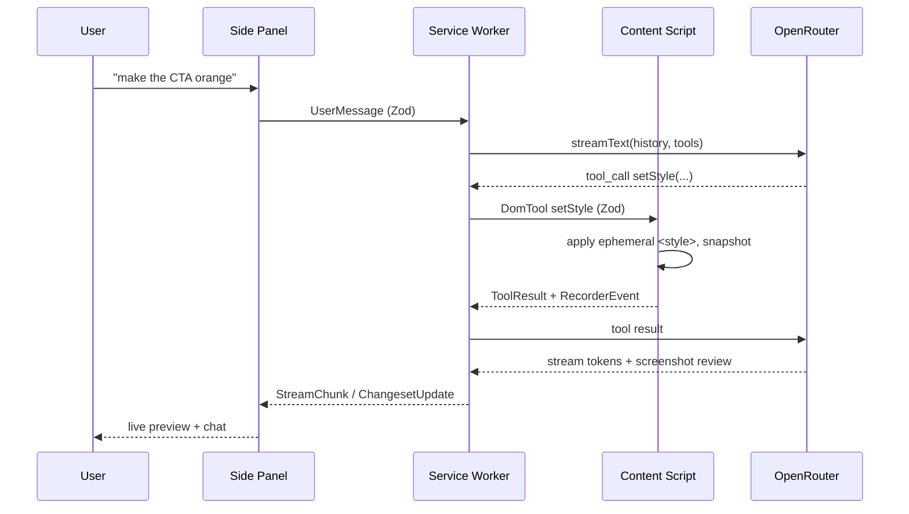

# MV3 worlds

Three execution worlds, hard boundaries. Crossing one always goes through the typed message bus.

| World | Origin / context | Trust | Can reach |
|-------|------------------|-------|-----------|
| **Side Panel** | Extension origin, isolated document | UI-trusted, no secrets | bus → SW |
| **Service Worker** | Extension origin, no DOM, ephemeral | secret-holder | OpenRouter, MCP, `chrome.storage`, bus |
| **Content Script** | Injected, shares the page's tab world | page-adjacent, untrusted-ish | DOM, bus → SW |

## Why keys never touch the content script

- The content script runs in the **page's** world — the page's own scripts can observe its globals and any leaked references.
- A compromised/hostile page must never see the OpenRouter key or MCP tokens.
- Therefore: all network calls to model + MCP originate in the **service worker only**. The content script gets *commands*, returns *results* — never credentials.

## Typed message bus

Every cross-world payload is Zod-validated in `src/shared/`. No raw `postMessage` shapes.

| Channel | Direction | Examples |
|---------|-----------|----------|
| UI | panel ↔ SW | `UserMessage`, `StreamChunk`, `ChangesetUpdate`, `TaskStatus` |
| DOM | SW ↔ content | `DomTool` (query/mutate/capture), `ToolResult`, `RecorderEvent` |

## Service-worker ephemerality

- MV3 can kill the SW at any idle moment. Treat it as **stateless between events**.
- In-flight turn state, changeset, and pending MCP tasks persist to `chrome.storage.session`.
- On wake, the SW **rehydrates** before handling the next message; the side panel is the source of truth for chat scrollback.

| State | Store | Lifetime |
|-------|-------|----------|
| Current turn / changeset | `chrome.storage.session` | Tab/session |
| Settings, keys (encrypted), MCP connections | `chrome.storage.local` | Persistent |
| Chat scrollback | Side panel memory (+ session mirror) | Session |
