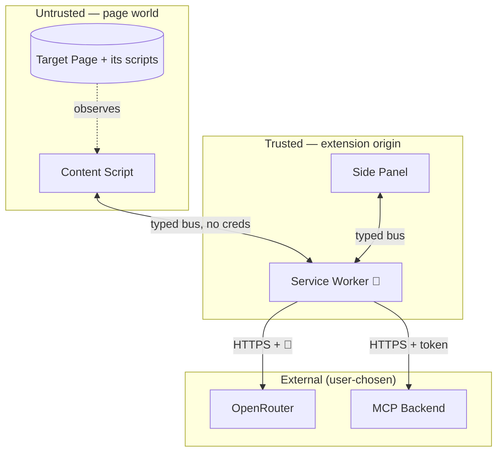

# Security

Threat model, trust boundaries, and the rules that keep secrets and page content safe. See [principles.md](../idea/principles.md).

## Trust boundaries

The only secret-holding component is the **service worker**. Everything else is treated as potentially observable.

## Key custody

| Secret | Stored | Used from | Never in |
|--------|--------|-----------|----------|
| OpenRouter API key | `chrome.storage.local`, encrypted | service worker | content script, page, panel DOM |
| MCP token (OAuth/PAT) | `chrome.storage.local`, encrypted | service worker | content script, page |

- Encryption at rest via WebCrypto; key material never logged or rendered.
- Content script receives **commands and results**, never credentials (see [mv3-worlds.md](mv3-worlds.md)).

### How (OpenRouter key)

The wrapping key is a **non-extractable** AES-GCM-256 `CryptoKey` (`generateKey({ extractable: false })`) held in IndexedDB; the key ciphertext (`{ iv, ciphertext }`) lives in `chrome.storage.local`; decrypt is service-worker-only (`src/agent/key-store.ts`). Because the key is non-extractable, JS can never read its raw bytes — the key cannot leak via a log line or across the message bus.

What this does and does not buy:

- **Does:** real exfiltration resistance against a hostile page / XSS / casual disk inspection, and makes "encrypted at rest via WebCrypto" honest. The at-rest ciphertext and its wrapping key are in **different** stores (IndexedDB vs `chrome.storage.local`), not co-located.
- **Does not:** defend against a full local-machine compromise. A non-extractable key prevents key *exfiltration*, not key *use* — code already running with the extension's own privileges can still call `decryptSecret`. No browser-extension key custody can defend that, and we don't claim to.

## Threats & mitigations

| Threat | Mitigation |
|--------|-----------|
| Hostile page reads the API key | Keys live only in SW; content script gets no creds |
| Hostile page exfiltrates DOM via our network | Content script has no model/MCP network path |
| Remote code injection | No `eval`, no remote scripts; Solid prebuilt; MV3 CSP |
| Over-broad host access | `activeTab` + opt-in `optional_host_permissions`; no blanket grant |
| Leaking page content to third parties | Page content/screenshots go **only** to the user's chosen model + MCP; no telemetry of page contents |
| Silent prod write | Nothing ships except a reviewable PR; agent never auto-merges or auto-ships |
| Token theft via XSS in panel | Panel holds no tokens; strict CSP on extension pages |

## Least privilege

- Default permissions: `sidePanel`, `storage`, `scripting`, `activeTab`, `tabs`.
- Host permissions requested per-site, on demand. User can scope to a single origin.
- MCP connection is opt-in and per-backend; tokens revocable from MCP management UI.

## Privacy posture

> Formal, user-facing privacy policy + data-handling disclosure: [privacy.md](privacy.md).

- BYOK end to end — we sit between the user and *their* providers; we don't proxy or resell.
- No first-party server in v0/v1; nothing about the page leaves the user's chosen endpoints.
